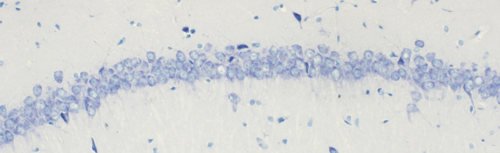

# YOLOv8m neuron detection

This model allows count neurons stained using the Nissl method in the CA1 field of the hippocampus ​​300 μm area.
It counts only alive cells. 

The model takes photos of a rat`s hippocampus specimen as input. The microscopic magnification is 20x, 
base photo resolution - 2048х1504 pixels.




## Usage
#### 1. Clone the repo and install all dependencies
```python
git clone https://github.com/chistotinsa/YOLOv8m_neuron_detection
pip install -r requirements.txt
```

#### 2. Run the script
To run the main script — 
1. Put your photos 2048х1504 pxls into the 'photo' folder
2. Run scripts/neuron_count.py and check the 'results' folder
3. The output includes Excel table with number of alive neurons on a random
   300 μm hippocampus area per each input photo and photos with detected neurons outlined in red boxes.
